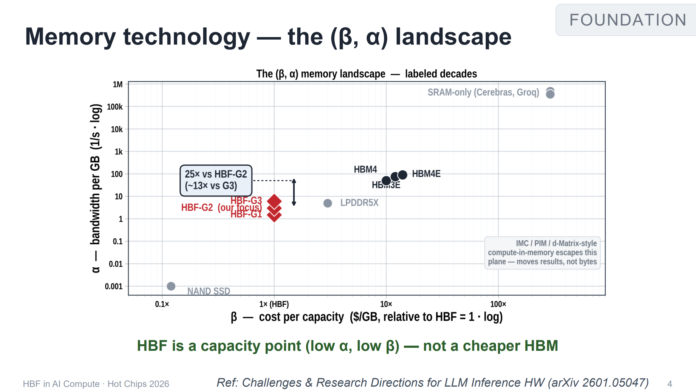
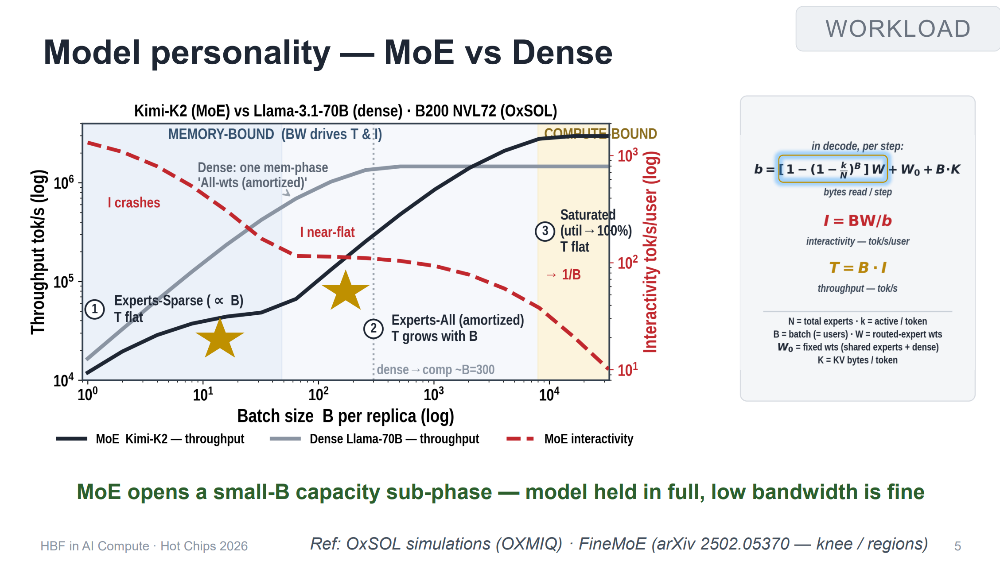
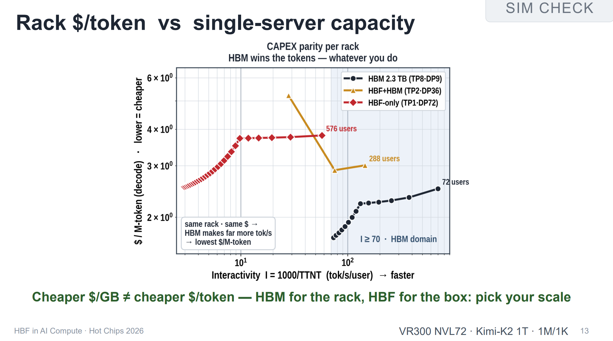

# HBF 是 HBM 的替代吗？单位存储便宜了，Token 成本却可能更高

**说明**：本文基于 Hot Chips 2026 Tutorial 1《HBF in AI Compute – A System Architect's View》，Anurag Agrawal（OXMIQ Labs，系统架构）与 Radhakrishna Giduthuri（PRAXMATI，软件架构）主讲，2026 年 8 月 23 日。

> **时效性提醒**：截至写作时 HBF 没有量产产品，OCP 规范版本为 v0.7.0。文中仿真结果、$ 数字与价格均为特定时点口径，会随产品落地变化，引用前请复核。

## 一、内存荒里的一个便宜承诺

2026 年 2 月，TrendForce 把 1Q26 的常规 DRAM 合约价涨幅上修到 +90%–95%，NAND 上修到 +55%–60%，并称各类产品季增幅度将创历史新高。到第二季度，NAND 环比 +70%–75%，在本轮周期里第一次涨得比 DRAM 还快；SK hynix 称 2026 全年 HBM 产能已售罄，Kioxia 的 NAND 产能同样售罄。

涨价的原因不在闪存本身。先进制程产能被服务器 DRAM 和 HBM 抽走，厂商把产线从 NAND 挪向 DRAM，企业级 SSD 反而变成最大的 NAND 需求方。需求侧同时在膨胀：万亿参数 MoE 把专家权重推到 TB 量级，1M 上下文把 KV Cache 推到几十 GB 每条请求。

HBF（High-Bandwidth Flash，高带宽闪存）就是在这样的背景下被反复提起的。它把 3D NAND 按 HBM 的方式垂直堆叠、和计算 die 同封装、用 UCIe 互连，宣传口径是 8 到 16 倍于 HBM 的容量、成本几乎持平。对于模型参数越来越大的推理场景，这个数字很难不让人心动。

这个概念的提出时间是 2025 年 2 月，SanDisk 从西部数据分拆后的第一次投资者日，主讲人 Alper Ilkbahar 现在已升任 SanDisk CTO。之后节奏不慢：2025 年 8 月 SanDisk 与 SK hynix 签谅解备忘录，2026 年 2 月 OCP 的 HBF workstream 成立，六个月后的 2026 年 8 月 3 日，首份 HBF 技术规范通过 OCP 发布，Google 与 Tenstorrent 以成员身份加入。规范的正式名称是《High Bandwidth Flash (HBF) High-Level Base Die Specification》v0.7.0，正文 130 页；报告引用时简写成 OCP HBF Architecture Specification v0.7.0。本文下面凡标「规范」处，都指这份文档。

Hot Chips 2026 的这场 tutorial，是这份承诺第一次被系统架构师拆开算账。它的结论写在第 4 页幻灯片上：

> HBF is a capacity point (low α, low β) — not a cheaper HBM
> （α 低、β 也低，HBF 是冲着容量去的，不能当便宜的 HBM 用。）

## 二、坐标系：容量便宜，带宽昂贵

要理解这句话，先得有个能把各种存储介质放在一起比较的坐标系。报告借用的是 arXiv:2601.05047 里的 (β, α) 地景：

- **β（横轴）** 是单位容量成本，$/GB，以 HBF = 1 为基准的对数轴
- **α（纵轴）** 是单位容量带宽，即每 GB 能分到多少吞吐，也是对数轴

把各家放上去，位置分布得相当开。SRAM-only 方案（Cerebras、Groq）在右上角远处，β 比 HBF 贵五个数量级，换来的 α 高约六个数量级；HBM3E / HBM4 / HBM4E 挤在中右部，β 约 10–30 倍，α 约 100–300；LPDDR5X 落在 1× 与 10× 之间；NAND SSD 在最左下，β 只有 HBF 的 0.1 倍，但 α 低到 0.001；HBF 的 G1/G2/G3 三个等级落在左下角一小片区域，β = 1，α 在 1 到 10 之间。

图上有一处标注是整页的核心：HBM 对 HBF-G2 的 α 高出 25 倍（对 G3 约 13 倍）。换成直白的话，同样 1 GB 容量，HBM 能分到的带宽是 HBF 的 25 倍；HBF 用容量换来的便宜，代价是带宽低了一个多数量级。

这里要分清量和价。α 说的是量，**单位带宽的成本**是 β/α。翻到第 7 页那组同成本配置可以直接算：HBM-only 是 288 GB / 22.0 TB/s，All-HBF 是 4,096 GB / 12.8 TB/s。同成本下 HBF 每 GB 便宜 14 倍（4,096/288），带宽却只有 0.58 倍（12.8/22.0）。两者相除，**HBF 每买 1 TB/s 带宽，成本是 HBM 的 1.72 倍**。α 低得比 β 少得更多（25 倍 vs 14 倍），折算到带宽单价上就翻了盘。所以「带宽更低」和「带宽更贵」说的是同一件事的两面：前者是量，后者是价，中间隔着 β/α 这一步除法。

右下角还有一行小字：compute-in-memory（IMC / PIM / d-Matrix 一类）不在这张平面上，因为它搬运的是结果而不是字节。

报告全篇的对照口径是 HBM4/4e ↔ HBF-G2、HBM5 ↔ HBF-G3，按产品排期对齐。也就是说，HBF 要竞争的是 2026–2027 这一代的 HBM4，而不是当期的 HBM3E。

## 三、$/token：一个被 max() 决定的公式

坐标系解释了 HBF 站在哪里，但没有回答该不该买。报告第 6 页把这个问题写成一行公式：

$$
\$_{\mathrm{mem}} = \beta \cdot \max\left(C,\ \frac{\text{BW demand}}{\alpha}\right), \qquad \text{BW demand} = I \cdot b
$$

其中 $C$ 是必须占用的物理容量（GB to HOLD，装下模型和上下文的那部分），$I$ 是用户感知的交互速度（tok/s/user），$b$ 是单步解码需要搬运的字节量，$I \cdot b$ 是带宽需求，再除以 $\alpha$ 得到折算成容量的带宽需求（GB to FEED）。

决定账单的是那个 `max()`。最终成本由两项里更大的那个决定：

- **容量瓶颈区**：$C$ 占上风。此时 β 极低的 HBF 便宜得离谱。
- **带宽受害区**：$I \cdot b / \alpha$ 反超。为了补齐缺的带宽，你得买远超实际存储需求的颗粒，多出来的容量变成没有产出的僵尸容量。每 token 的真实成本反而上去。

报告给这一页配的注解是：你不是在用钱买 GB，你买的是这个方程的结果。第 21 页把评价函数进一步简化成一个品质因数 $(β/α) \cdot b$，介质的 β/α 乘以工作负载的单步字节数，两个因子都得看。

这就是标题那句话的机制来源：

> The cheapest $/GB can be the most expensive $/token.
> （最便宜的每 GB 单价，可能会变成最贵的每 Token 成本。）

## 四、优势区在哪里：MoE 的低并发容量子相位

$b$ 不是一个固定值，它取决于模型结构和一个运行参数。报告第 5 页把它写开：

$$
b = \left[1 - \left(1 - \frac{k}{N}\right)^B\right] W + W_0 + B \cdot K
$$

$N$ 是专家总数，$k$ 是每个 token 激活的专家数，$B$ 是 batch（等于并发用户数），$W$ 是所有路由专家的权重总量，$W_0$ 是固定权重（共享专家加 dense 部分），$K$ 是单用户的 KV 字节数。

第一项决定了回扣曲线的形状。batch 很小时，$1 - (1 - k/N)^B$ 约等于 $B \cdot k / N$，每步读入的专家权重大致正比于 $B$ 且系数极小：模型全量必须驻留在介质里，但每步只碰其中很窄的一条。batch 涨上来之后这一项快速饱和，权重读取变成全量，带宽需求被拉满。

用 Kimi-K2（MoE）和 Llama-3.1-70B（dense）在 B200 NVL72 上跑 OxSOL 仿真，三条分界线很清楚：

| 区段                 | 特征                                                        | 谁在跑         |
|----------------------|-------------------------------------------------------------|----------------|
| ① Experts-Sparse     | 带宽随 B 增长但极缓，吞吐 T 基本持平，交互度 I 接近持平     | MoE 小并发     |
| ② Experts-All        | 权重读取已被摊平，T 随 B 线性增长                           | 两侧通吃       |
| ③ Saturated          | 算力打满，T 不再随 B 涨                                     | 高并发         |

dense 模型没有区段 ①，它每生成一个 token 都要把全量权重过一遍总线，曲线直接从左上角的高交互度往下摔。报告在图上把 dense 的拐点标在 B ≈ 300 附近。

所以 HBF 的生存空间来自一个具体的结构事实：MoE 在低并发时开出了一个容量子相位，模型得完整装下，但带宽需求极低。这个区间里 HBF 的 α 劣势用不上，β 优势全发挥。

## 五、同成本下的三种方案

知道了优势区的形状，再看第 7 页给的三种同成本方案：

| 方案                        | 容量         | 峰值带宽                              |
|-----------------------------|--------------|---------------------------------------|
| HBM-only（基线）            | 288 GB       | 22.0 TB/s                             |
| (a) All-HBF（8×HBF-G2）     | 4,096 GB     | 12.8 TB/s                             |
| (b) 2×HBF + 6×HBM           | 1,240 GB     | 19.7 TB/s（跨 batch 有效值 19→4）     |

幻灯片给这三张图的注解是：Same cost. More capacity. Less bandwidth.

### 5.1 短上下文：赢在成本，代价是 85% 死容量

256 进 / 256 出，Kimi-K2 权重约 538–615 GB，随 batch 从 8 涨到 128：

- HBM 方案需要 2 张卡（0.58 TB，44 TB/s），成本 2×
- 全 HBF 方案需要 1 张卡（4 TB，12.8 TB/s），成本 1×

低 batch 下 HBF 的成本地板只有 HBM 的一半，成绩不差。但结论行把代价写得很直接：85% 的容量是死的。4 TB 里真正装下的只有五百多 GB 的权重和少量 KV。

一旦交互速度要求上去，带宽需求线就会撞上 12.8 TB/s 的墙；越过之后要补带宽只能加卡，成本曲线接近垂直上翘，HBM 方案在这个区间反杀。幻灯片上还标了另一条线：如果真要把 4 TB 填满（多模型或超长上下文），那就得堆到 14 张卡、308 TB/s，容量对齐但成本 14×。

### 5.2 长上下文：只在带宽需求低时成立

1M 进 / 1K 出，同一个模型权重涨到 664–2,631 GB：

- HBM 方案 4 张卡（1.1 TB，88 TB/s），成本 4×
- 全 HBF 方案仍是 1 张卡（4 TB，12.8 TB/s），成本 1×

这次 HBM 的多卡换来的是实打实的带宽，而不是闲置容量。结论行同样直白：容量只在 $I \cdot b$ 保持低位时赢，过了那条线，HBM 是更划算的买法。

### 5.3 用 HBM 做热专家缓存：被一条曲线否掉

一个很自然的想法是分层：把最热的专家放 HBM，冷的放 HBF。第 10 页用一条覆盖曲线说明为什么行不通。多并发下实际被读到的专家比例是：

$$
\rho_{\mathrm{eff}}(B) = 1 - \left(1 - \frac{k}{N}\right)^B
$$

注意它和 $b$ 的第一项是同一个式子。单个用户只碰 $k/N$ 比例的专家，但 $B$ 个用户各碰各的，取并集后迅速膨胀。按各模型实际的 $k/N$：

| 模型                 | $k/N$     | $\rho_{\mathrm{eff}}$ 达到 90% 所需的 batch     |
|----------------------|-----------|-------------------------------------------------|
| Mixtral-8x7B         | 25.0%     | ≈ 8                                             |
| Qwen3-235B-A22B      | 6.2%      | ≈ 36                                            |
| DeepSeek-V3          | 3.1%      | ≈ 73                                            |
| Kimi-K2              | 2.1%      | ≈ 109                                           |
| Kimi-K3              | 1.8%      | ≈ 127                                           |
| Llama-4-Maverick     | 0.8%      | ≈ 287                                           |

MoE 越稀疏，缓存越晚才划算。只要 batch 上到几十，DeepSeek-V3 一级的模型就已经有四到五成专家被命中；到了 Kimi-K3 这个稀疏度，缓存要等到上百并发才有意义。报告的结语是：专家流行度在混合查询下会摊平，缓存只在低 batch 时、或者把同类查询凑在一起批处理时才有收益。

## 六、机架看 HBM，单机看 HBF

单卡视角的结论不足以做部署决策，幻灯片把战场拉到 72 卡机架，条件是同 3 年 TCO（capex + opex）、同功耗预算：

| 72 卡机架          | HBM-only（TP8·DP9）     | HBF-only（TP1·DP72）     | HBF+HBM（TP2·DP36）     |
|--------------------|-------------------------|--------------------------|-------------------------|
| 单 DP 可用显存     | 2.3 TB                  | 4.1 TB                   | 2.5 TB                  |
| 整机架容量         | 20.7 TB (1×)            | 294.9 TB (14×)           | 89.3 TB (4.3×)          |
| 整机架聚合带宽     | 1,584 TB/s              | 922 TB/s (0.6×)          | 1,418 → 279 TB/s        |
| 单卡峰值带宽       | 22.0 TB/s               | 12.8 TB/s                | 19.7 → 3.9 TB/s         |
| 成本 · 功耗        | 1× · 持平               | 1× · 持平                | 1× · 持平               |

仿真模型是 Kimi-K2 1T @ FP4，1M 进 / 1K 出，每 DP 的 batch 在 1–512 之间扫，decode 为主。

架构上的分化比数字更有意思。纯 HBM 方案单卡装不下万亿模型，必须 TP8 切分，一台 72 卡机柜只能支撑 9 组服务实例；纯 HBF 方案单卡 4.1 TB 装得下整个模型，变成 TP1·DP72，72 组完全独立的服务实例。

但机架级的 $/M-token 曲线给出了相反的答案。横轴是交互速度 $I = 1000/\mathrm{TTNT}$（tok/s/user），纵轴是每百万 token 的解码成本，对数刻度。三条曲线的形状：

- HBM（黑）：$I$ 从 20 升到 150 时成本从约 \$2.6 降到约 \$2.0，之后回升到约 \$2.5，服务到 72 用户
- HBF+HBM（金）：低交互度时成本最高（约 \$5.5），$I$ 上去之后回落到约 \$2.9，服务到 288 用户
- HBF-only（红）：$I$ 很低时约 \$2.6，随 $I$ 升到约 \$3.75 后走平，能服务到 576 用户

按图读，HBM 方案的成本稳定在 \$2.0–2.6/M-token，全 HBF 稳定在 \$3.7–3.8。报告把 $I \geq 70$ 划成 HBM 的地盘（图上是阴影区），理由是那行注释：机架的电费、折旧都摊上了，必须靠 1,584 TB/s 的总带宽拼命喷 token，HBF 吞吐慢、单位时间产出的 token 少，每个 token 摊到的固定成本反而更贵。

> **口径提醒**：这两组 \$ 数字是从对数坐标轴上读的，幻灯片没有以数字形式给出。量级可信，小数点后一位不要当精确值引用。

再把镜头切到单机（第 14 页，同样是 Kimi-K2 1T、1M/1K）：

| 单实例配置     | 显存       | 带宽          | 成本/功耗     | 最大用户数     |
|----------------|------------|---------------|---------------|----------------|
| 8 张 GPU       | 2.3 TB     | 176 TB/s      | 8×            | 112            |
| 2 张 GPU       | 2.5 TB     | ~40 TB/s      | 2×            | 128            |
| 1 张 GPU       | 4.1 TB     | 12.8 TB/s     | 1×            | 232            |

在 $I < 74$ 的区间，8 卡的 HBM 方案根本服务不了，它在 112 个用户时 OOM。而单卡 HBF 方案一直能撑到 232 个用户，成本和功耗都是 1×。

一句话概括这套对比（报告的原文）：

> Cheaper $/GB ≠ cheaper $/token — HBM for the rack, HBF for the box: pick your scale.

## 七、要把 vLLM 改成什么样

报告后半程切到软件侧，第一个问题是：如果真给一张带 HBF 的卡，内存该怎么分配？第 17 页拿 Kimi-K3（2.8T，权重合计 1.56 TB）做解剖：

| 组成                         | 大小        | 占比     | 建议介质                      |
|------------------------------|-------------|----------|-------------------------------|
| MoE 专家权重                 | 1.45 TB     | 93%      | HBF（只写一次、冷态读取）     |
| attention + 其它固定权重     | 110 GB      | 7%       | HBM（计算密集、频繁访问）     |
| 单条 1M 序列的 KV Cache      | 30 GB       | —        | HBF（卸载池 + 前缀缓存）      |

93% 的字节是只写一次、冷态读取的专家权重，这个生命周期特征确实和闪存对得上。剩下的 7% 计算密集、访问频繁，留在 HBM。

第 18 页给出了改造后的 vLLM 内存子系统（文字还原）：HBM 侧是 Model Weights (resident)、Paged KV Cache、Activations 和 Router MoE 权重；HBF 侧用红色虚线框标出，包含 Paged KV Offload Pool、Prefix KV-Cache 和 1.45 TB 的 MoE Experts Pool，框上注明 _instead of host CPU pinned-memory_；左侧另有两块外部存储，SSD-resident KV 与 Scale-out RDMA Remote KV Pools。

HBF 层的位置是顶替 host CPU pinned memory，也就是现在 KV Cache 卸载和权重换出要经过的慢速主机内存与 PCIe 通道。改造后，GPU 封装内形成一个双层存储池：HBM 层放活跃激活值、路由网络和当前步要用的 KV；HBF 层放 1.45 TB 的 MoE 专家池和 Paged KV 卸载池。片内的搬运靠异步预取掩盖闪存延迟，不再走 PCIe。

给出的参考配置是 4×HBM + 4×HBF，单卡 2.2 TB、约 17.4 TB/s 峰值带宽。

图例里有一行必须注意：**「MoE Experts Pool is not yet available in vLLM」**。vLLM 目前根本没有 MoE 专家池这个功能，最诱人的那块（把 1.45 TB 专家权重挪进 HBF）在引擎里还不存在对应组件。报告自己也承认，今天 vLLM 的卸载路径全部指向 CPU/LMCache，HBF 的 allocator、放置策略、异步预取、寿命遥测都还没有东西。

## 八、闪存的七道枷锁

第 15 页把 HBF 的软件约束列成一张清单。这些都是 NAND 介质的物理性质，逐条都能在规范里找到出处：

| 约束         | 内容                                                                                                   | 后果                                 |
|--------------|--------------------------------------------------------------------------------------------------------|--------------------------------------|
| 访问粒度     | 协议层：读 64 B–4 KiB（64 B 对齐、不跨 4 KiB 页），写 4 KiB 突发；要跑满带宽则需 64 KB 读、1 MB 写     | 不能用 64 B cacheline 精细读写       |
| 写入路径     | 4 KiB 写必须在 NAND 块内连续、禁止跳地址；块擦除由设备在收到 page-0 写时自行触发                       | 写入放大不可避免                     |
| 通路         | 读写走 DMA，不接入 GPU cache 层级                                                                      | 必须由软件显式搬运                   |
| 保持期       | 85 ℃ 上电保持 24 小时（规范明确承诺）；断电后不保证，规范称「等同于 HBM」                              | 需要主机侧周期性巡检与刷新           |
| 寿命         | 规范把耐久性列为 Product Specific，通过 MAXPEC / AVGPEC 寄存器交由主机监控                             | 剩余寿命由主机推算                   |
| 管理         | HBF 与 HBM 同系统时必须分开管理                                                                        | 不是透明的更大显存                   |
| 暂存         | 内置 scratchpad SRAM 是可选特性，64 B 粒度、掉电即失                                                   | 无法旁路 NAND 块                     |

先看访问粒度这一行，因为这里最容易把两个层级混掉。规范 §4.1 定的是协议层能力：读突发 64 B 到 4 KiB、写突发 4 KiB。而报告第 15 页说的「64 KB 读、1 MB 写」是另一回事——那是要把带宽跑满所需要的块大小，背后是跨 16 条主机通道的交织效率。两个数字都对，但一个说的是最小交易单位，一个说的是达到峰值吞吐的推荐批量。

「85 ℃ 上电保持 24 小时」在规范里是明确承诺的（Table 33：Power On Data Retention @85°C = 24 Hours）。同一张表还有半句更容易被忽略：断电之后 HBF 不再保证数据，规范的原话是「equivalent to HBM」。用通用 NAND 数据可以交叉验证这个量级：JEDEC 企业级断电保持指标是 40 ℃ / 3 个月，按 Arrhenius 模型（Ea ≈ 1.0 eV）折算到 85 ℃ 大约是 21 小时，与规范给的 24 小时吻合。而 GPU 封装的散热环境恰好落在这个温度附近，存储厂商的数据指出，70 ℃ 环境温度就足以让盘体达到 85 ℃。对贴装在计算 die 边上的 HBF 来说，这是工作点。

写入寿命那条，规范给的答案比「未定义」具体得多：耐久性一栏写的是 **Product Specific**，同时提供两个寄存器——MAXPEC（设计上限）与 AVGPEC（当前平均擦写次数）——交主机去算。规范原文是「The host is responsible for determining the remaining lifespan by comparing the dynamic AVGPEC against the static MAXPEC limit」。规范不写寿命，是因为它把寿命变成了一个运行期由主机监控的量。这与 SSD 把地址转换、垃圾回收、磨损管理全封进控制器的做法相反，也是「HBF 不是即插即用」这句话的出处。HBF 自身没有任何厂商公布过 P/E 数字；业界通用的 NAND 数据是 SLC 约 5 万–10 万次、TLC 约 1 千–3 千次、QLC 约 100–1000 次。

这张清单里没有的一项是延迟。报告全篇用带宽和容量算账，没有给出访问延迟的数字，而闪存的读延迟和 DRAM 根本不在一个量级。行业汇总口径把 HBF 的读延迟放在微秒级（数千纳秒），HBM4 在 10–100 纳秒，差一到两个数量级。这个数字不是报告数据，列在这里是为了对照：decode 每一步都在关键路径上等数据，延迟和带宽是两笔账，而报告的成本模型只算了后一笔。

最后排除一个容易混的类比。Intel Optane 是字节可寻址的，能当另一块内存用，败在每 bit 成本高、密度低；HBF 走的是反方向，靠 4 KiB 页和块内顺序写换取 NAND 的便宜和大容量，把复杂度转嫁给软件层。规划系统时，别把它当成一块更大的内存。

## 九、两个正在打开的窗口

第 19 页和第 20 页给出两条算法红利，能把 HBF 从边缘位置推进优势区。

### 9.1 稀疏注意力：把每步读取压到 1–2%

长上下文推理之所以吃带宽，是因为 full attention 每步都要把历史全刷一遍。稀疏注意力改变了这个前提。报告按第 19 页的式子给出的判据是：

$$
\varphi = \frac{\text{top-}k}{\text{context}} \approx 1\%\text{–}2\% \quad \ll \quad \varphi^* = \frac{\alpha}{I}
$$

$\varphi$ 是每步真正读的比例，$\varphi^*$ 是介质能承受的比例上限。当 $\varphi$ 远小于 $\varphi^*$ 时，整份 KV 可以便宜地摊在 HBF 上，每步只把 top-k 那一两千行捞出来。报告把这条标成「A genuine HBF fit」，但加了一个前提条件：只在稀疏注意力模型上成立，点名的是 DSA（DeepSeek Sparse Attention）、CSA（Compressed Sparse Attention）与 Kimi-Linear。

这条和我们仓库里已经写过的东西正好接上。[当百万 Token KV Cache 从 250GB 降到 5GB](post-kv-cache-era-challenges.md) 讲的是算法侧把每步要读的字节砍掉一个数量级，[把 KV Cache 压缩推到极限](deepseek-v41-flash-kv-compression.md) 讲的是压缩比再往下推。算法把 $b$ 压下去，硬件才有空间把介质换成便宜的。所以 HBF 能不能成立，取决于模型架构愿不愿意继续把稀疏度做上去。

顺带一提，稀疏注意力的读取模式和 HBF 的偏好是冲突的。top-k 是散读，而闪存喜欢顺序大块。这个矛盾在我们的 [稀疏注意力 × KV Cache Offloading](kv_cache/01_concepts/offloading/sparse_attention_driven_offloading_problems.md) 里已经从卸载角度枚举过八类问题，换成 HBF 只会更尖锐。

### 9.2 EP × HBF：用容量买回通信

第二条更直接。大规模 MoE 分布式推理最头疼的是 EP（专家并行）的跨卡通信：单卡装不下，专家被撒到多台服务器，每一层解码都要 all-to-all。

HBF 的单卡容量改变了这个约束的起点：每个节点本地冗余部署全量专家，2 个节点就能装下，几乎不需要 all-to-all。报告的原文是「Cheap HBF capacity → fewer EP shards → less all-to-all comm」。

## 十、这份报告没有回答的部分

前面九节都建立在报告的仿真结论上。到这一步必须交代它的边界，否则很容易读成一份推荐采购书。

第一，全部结论来自仿真。仿真器是 OXMIQ 自己的 OxSOL，模型是 Kimi-K2 / Kimi-K3，没有一片 HBF 硅片参与测试。

第二，HBF 目前没有产品。截至本文写作（2026-09-14）：首颗 HBF 内存 die 在 2026 年 8 月 13 日完成 tape-out，样品指引是 2027 年，公司没有给出任何量产年份；SanDisk 自己的 FY2028–2030 财务模型里不含 HBF 收入。StorageReview 的评论说得准确：「a tapeout is also several steps short of a product」。规范版本是 v0.7.0 而不是 1.0，这个数字本身也说明它还没定稿。

第三，把 HBF 当作「更快的 SSD」来用，反而会变慢。北大与复旦的一篇全栈表征工作（arXiv:2608.11668, 2026-08-25）把 HBF 换进 SSD 式的 KV 卸载栈实测，结论是 H100/B200 上端到端延迟上升 2–5.5 倍，最大 SLO goodput 下降 1.1–2.7 倍。原因很具体：KV 流量的写比读多（实测写读比 1.14×–4.90×），写密集流量触发热降频；而 HBF 层的寿命只有它所替代的 SSD 池的 0.56 倍。论文的结论一句话：_「HBF is not the problem, using it as a faster SSD for transient KV is.」_

第四，拿到收益的软件代价还没有被证明比替代方案更低。Chips and Cheese 在报道这份报告时给出的判断是：为一套为 DRAM 设计的内存管理逻辑做块对齐、DMA 驱动的改造，工作量不比直接从 SSD 流式加载模型权重更少，而后者反而省事：操作系统的页缓存天然把块对齐的坑填掉了大半，只要不碰 O_DIRECT 这类绕过缓存的接口。

这三份材料并不互相矛盾。OXMIQ 论证的是 HBF 在低带宽需求的容量场景里划算，那篇论文测的是 HBF 在写密集的瞬态数据场景里不划算，Chips and Cheese 质疑的是改造引擎的性价比。三条合起来，HBF 能不能用取决于你把什么放进去，以及你愿意为它改多少代码：专家权重（只写一次、冷读）和瞬态 KV（反复写、热读）是两种完全不同的负载。

## 十一、回到那一行公式

把报告的四条收尾（第 21 页）按顺序读一遍，会发现它就是对标题的回答：

1. 用品质因数判断介质。$\$_{\mathrm{mem}} = \beta \cdot \max(C, I \cdot b / \alpha)$，评价指标是 $(β/\alpha) \cdot b$，介质和负载的乘积，缺一个都算不对账。
2. HBF 只赢在一个区间。低带宽需求（$I \cdot b$ 小）的场景，即小 batch / 低交互度的 MoE，以及稀疏注意力支撑下的长上下文 KV。
3. 要扩大这个区间：读取带宽得涨（α↑），与 HBM 的 $/GB 差距得保持住（β↓），写入寿命与写入带宽、延迟得解决。
4. 软件得先到位。allocator、放置策略、异步预取、寿命遥测，今天 vLLM 的路径全部指向 CPU/LMCache，不指向 HBF。

报告的结语是：

> HBF: A precision instrument, not a hammer — bargain in its zone, trap outside it.

关于 HBF 的争论大多停在「HBF 好不好」上。这份材料里真正能拿去做决策的，是那行 `max()` 公式。它把「这个介质能不能用」变成两个可计算的量：你的工作负载单步要搬多少字节，以及这个介质的单位容量带宽是多少。容量便宜不等于推理便宜，在 $/token 这个指标面前，容量和带宽是乘法关系。

## 参考资料

- **原始素材**：Hot Chips 2026 Tutorial 1《HBF in AI Compute – A System Architect's View》，Anurag Agrawal（OXMIQ Labs）、Radhakrishna Giduthuri（PRAXMATI），2026-08-23，22 页。会议议程：<https://hotchips.org/advance-program/>。**幻灯片未由会议方公开发布**，本文引用的页面与三张配图取自公众号转载版还原的原图；文中规格数字均与 OCP 规范原文逐条对照，**核对日期 2026-09-14**。
- OCP《High Bandwidth Flash (HBF) High-Level Base Die Specification》v0.7.0，2026-08-03 发布，130 页，Sandisk 与 SK hynix 为主要贡献方。规范原文：<https://www.opencompute.org/documents/ocp-hbf-architecture-specification-v0-7-0-final-pdf>（该站会拦截自动化请求，浏览器可正常打开；命令行取需完整浏览器 UA + HTTP/1.1）。[发布新闻稿](https://www.sandisk.com/company/newsroom/press-releases/2026/2026-08-03-Sandisk-and-sk-hynix-advance-global-standardization-of-hbf)
- 独立报道：[ServeTheHome](https://www.servethehome.com/oxmiq-labs-hbf-in-ai-compute-at-hot-chips-2026/)、[Chips and Cheese](https://chipsandcheese.com/p/hot-chips-2026-applying-high-bandwidth)
- 中文报道：[电子工程专辑（EET China）](https://www.eet-china.com/mp/a522097.html)、[ic.work](https://www.ic.work/article/hot-chips-2026-high-bandwidth-flash-hbf-explained)（延迟对照表与 Optane 对比出自此篇，为其行业汇总口径，非报告数据）
- 反方实测：Zhuoran Li et al., _HBF Sucks? A Full-Stack Characterization of High-Bandwidth Flash for KV-Centric LLM Serving_, arXiv:2608.11668v3, 2026-08-25. <https://arxiv.org/html/2608.11668v3>
- 报告引用的学术工作：arXiv:2601.05047（(β, α) 地景）、arXiv:2502.05370（FineMoE）、arXiv:2508.17137（MoE-Beyond）、arXiv:2401.14361（MoE-Infinity）、arXiv:2605.03375（Tutti）
- 成熟度：[StorageReview 关于首颗 die tape-out 的报道](https://www.storagereview.com/news/sandisk-tapes-out-its-first-hbf-memory-die-targets-2027-for-inference-product-samples)
- 价格数据：TrendForce 2026-02-02 存储器价格上修公告 <https://www.trendforce.com/presscenter/news/20260202-12911.html>

## 口径说明

正文的数字绝大多数直接来自报告幻灯片；下面几处的出处不同，列在这里备查：

| 内容                            | 出处                        | 说明                                                     |
|---------------------------------|-----------------------------|----------------------------------------------------------|
| 带宽单价 1.72 倍、α 比 25 倍    | 幻灯片 p.7 数字 + 本文推导  | 幻灯片未给这两个比值，为本文相除所得（1.72 = 22.0/12.8） |
| 机架 $/M-token 曲线数值         | 幻灯片 p.13                 | 对数轴上的目视读取，非幻灯片标注                         |
| 延迟对照（微秒级 vs 10–100 ns） | ic.work 行业汇总口径        | 非报告数据，报告未给出任何延迟数字                       |
| NAND P/E 寿命区间               | 存储厂商通用数据            | 非 HBF 专属数据，HBF 自身 P/E 未公布                     |
| 85 ℃/24h 的量级验证             | JEDEC 指标 + Arrhenius 折算 | 本文独立推算，非报告内容                                 |
