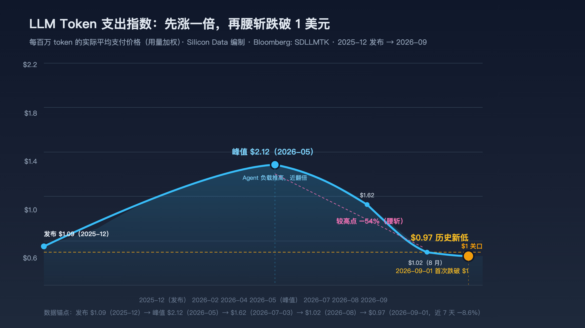

# 素材：Silicon Data LLM Token 支出指数——全市场平均支付价跌破 1 美元

> 用途：支撑 P2 开场「市场级价格信号」备料、4.6 价格瀑布市场级旁证、Q&A「价格战见底/全市场均价多少」。**市场级锚点**：比单模型目录价更有说服力——它是所有人付给所有模型的实际平均价。
>
> 数据时点：2026-09-01（周一）核实。

## 一、指数定义

- **编制**：市场情报公司 Silicon Data；**Bloomberg 代码 SDLLMTK**。
- **度量**：全市场每百万 LLM token 的**平均支付价格**——按实际用量加权，由"供应商定价 × 多个 AI 路由平台的观测用量"合成。
- 与目录价的区别：目录价是"标价"，指数是"实际平均成交价"（含用量结构、路由分发、动态定价）。

## 二、最新数据与历史轨迹（2026-09-01 核实）

| 时点 | 指数值 | 事件 |
| --- | --- | --- |
| 2025-12 | ~$1.09 | **发布基线** |
| 2026-05 | ~$2.12（峰值） | Agent 负载推高，较发布**近翻倍** |
| 2026-07-03 | ~$1.62 | 从峰值回落 ~20% |
| 2026-08 | ~$1.02 | 7 天 −9.1% |
| **2026-09-01** | **$0.97（历史新低）** | **首次跌破 $1**，较峰值 −54%（腰斩），7 天 −8.6% |

**曲线形态（演讲叙事用）**：先涨一倍（需求推高）→ 再腰斩（供给与开源把价格打下来）——"价格不是单调下降"的完整故事。

（SVG 源文件：`silicon-data-token-index-trend.svg`；曲线为公开报道数据锚点连线，非逐日数据）

## 三、驱动因素

1. 中国低价开源模型崛起（Moonshot Kimi K3 等）；
2. OpenAI 对两款 GPT-5.6 模型降价（2026 年 7 月底宣布）；
3. 前沿实验室推出**动态定价**（价格随需求波动）；
4. token 生成成本持续下降（GPU 利用率、量化、缓存等）——呼应演讲第三部分。

## 四、演讲用法

| 引用点 | 用法（口播级） |
| --- | --- |
| P2 开场备料 | "不是某个模型降价——硅谷情报公司追踪的全市场平均支付价，跌破了 1 美元/百万 token，历史新低、较峰值腰斩" |
| 4.6 价格瀑布 | 市场级旁证：平均支付价较峰值腰斩且仍在创新低——"下降不是单调"的当下注脚 |
| Q&A「价格战什么时候见底？」 | 指数创新低 = 价格战仍在进行时的权威证据；"价格跌但用量停滞"才是危险信号——目前用量在涨 |
| 5.1 杰文斯 | 单价端与用量端对照：指数新低（价格端）× 用量 1400 倍（用量端）——杰文斯正在发生 |

## 五、口径注（引用前必读）

1. **指数起点 2025 年底**——**不能参与"三年 140 倍"的计算**（主线锚点是 GPT-4 $60 → Qwen3.8-Flash 输出 3 元，可验证的目录价）；指数只做"当下仍在跌"的旁证；
2. **口径不同**：指数是"平均支付价"（输入+输出混合、用量加权），与主线"输出单价"锚点不是一个口径——**不能混入主线倍数，只能独立引用**；
3. 供应商影响面（对外可讲）：token 价格通缩压缩收入，而算力承诺固定——对 OpenAI/Anthropic（已提交 IPO 保密文件）的定价权是压力；价值正从模型能力转向分发、记忆与上下文（呼应演讲 5.2）。

## 六、来源链接

- 钛媒体：https://www.tmtpost.com/nictation/8125887.html
- 格隆汇：https://dxpress.gelonghui.com/live/2646869
- 东方财富：https://caifuhao.eastmoney.com/news/20260902163004436512380
- digitoday（韩）：https://www.digitaltoday.co.kr/cn/view/98937/ai-token-price-index-hits-record-low-amid-intensifying-competition
- stockstar：https://stock.stockstar.com/KX2026090200028407.shtml
