# 《Token Factory：AI 推理的成本革命》图文讲解

> 南京大学校友分享（2026 年 9 月）· 本文按 PPT 逐页配图讲解，全文围绕三个问题展开：Token Factory 是不是一个好生意？怎么才能赚钱？AI Infra 有哪些事情要做？

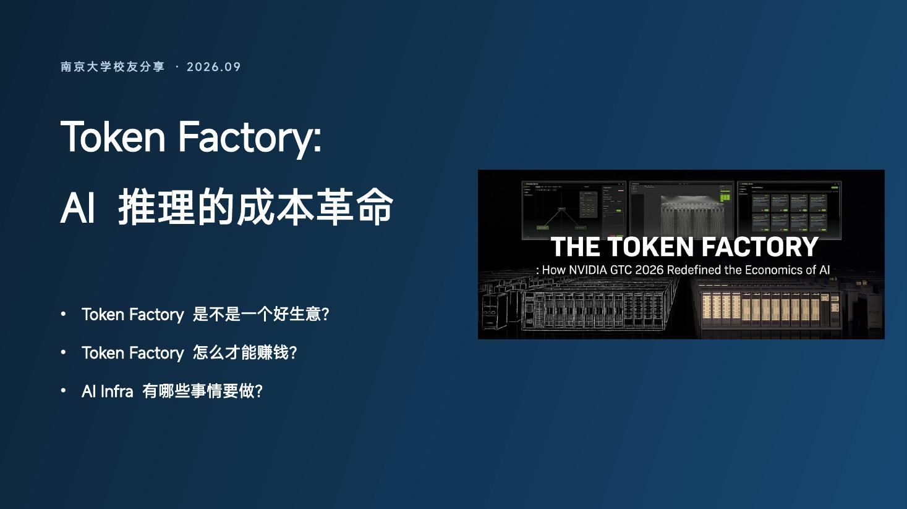

## 写在前面：一场关于"AI 成本"的分享

先做一个交代：这篇图文源于一个经常被问到的问题：大模型价格跌成这样，做算力、做推理的人还有没有活路？

带着这个问题，我整理了一次分享，尝试回答三件事：**Token Factory 是不是一个好生意？怎么才能赚钱？AI Infra 有哪些事情要做？** 下面的每一页，都是这次分享的现场内容。

在展开之前，先把核心观察放在最前面，方便你带着框架看图：

1. **AI 已经"白菜化"了**——开源生态日益成熟、调用价格快速走低，token 正成为 AI 服务中可计量、可定价、可交易的基础单位。
2. **数据中心的角色正在升级**——从"算力房东"变成"产品制造商"，真正的 KPI 不再是卖出多少 GPU 小时，而是单位电力产出多少 token、对外承诺的服务质量能否稳定兑现。
3. **这门生意的关键只有两件事**——一是把产能做上去：通过模型稀疏化、缓存压缩、PD 分离、投机解码等系统工程手段，提升单卡吞吐与整体利用率；二是让 token 更值钱：单纯售卖低价 token 难以盈利，把行业 know-how 封装成方案、让客户为"结果"付费，才是可持续的路径。

---

## 一、开场：AI 的白菜化（页 01–02）

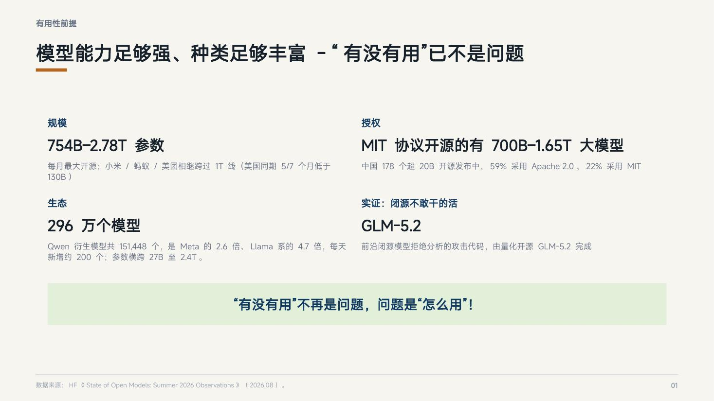

分享从一个"反常识"的前提开始：**"有没有用"已经不是问题了。** 四个事实支撑这句话——规模上，每月最大的开源发布已达 754B–2.78T 参数，小米、蚂蚁、美团相继跨过 1T 线；授权上，700B–1.65T 的大模型以最宽松的 MIT 协议开源；生态上，HF Hub 托管着 296 万个模型，其中 Qwen 衍生模型每天新增约 200 个；实证上，前沿闭源模型拒绝分析的攻击代码，由量化开源模型 GLM-5.2 完成——开源连"闭源不敢干的活"都能干。

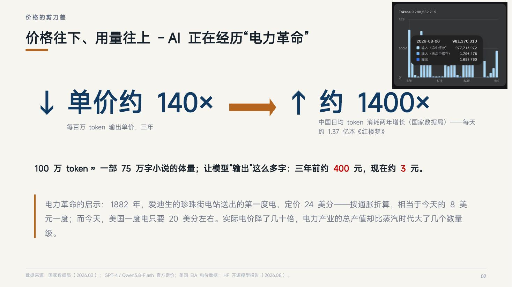

既然有用，剩下的问题就是价格。这一页的两个箭头，是我认为理解当下 AI 产业最重要的两个数字：**单价往下、用量往上**。每百万 token 的输出单价，三年大约跌了 140 倍——让模型"输出"一部 75 万字小说体量的文字，三年前要 400 多元，现在约 3 元；而中国日均 token 消耗两年增长了约 1400 倍，相当于每天写出 1.37 亿本《红楼梦》。

这个"剪刀差"像极了 140 多年前的电力革命：爱迪生珍珠街电站送出的第一度电，按通胀折算相当于今天的 8 美元；今天美国一度电只要 20 美分左右。实际电价降了几十倍，电力产业的总产值反而比蒸汽时代大了几个数量级。

---

## 二、一座 Token 工厂：从"算力房东"到"产品制造商"（页 03–06）

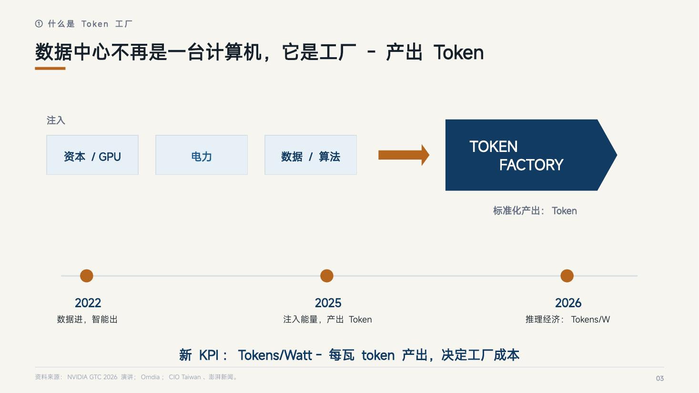

黄仁勋在 GTC 上给过一句话："数据中心不再是一台计算机，它是一个工厂——给工厂注入能量，产出的产品叫 Token。"这个比喻是我整场分享的地基。2022 年他谈"数据进、智能出"；2025 年升级为"注入能量，产出 Token"；2026 年干脆宣布了"推理经济"，新 KPI 只有一个：**Tokens/Watt——每瓦 token 产出**。谁能在单位电力里产出更多 token，谁的成本就更低。

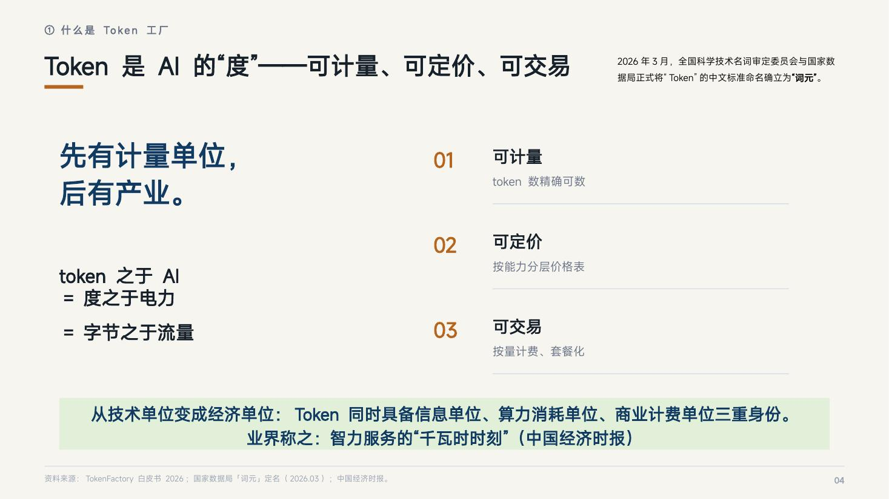

为什么 token 能当"产品"来卖？因为它同时具备三重身份：**信息单位、算力消耗单位、商业计费单位**。可计量（token 数精确可数）、可定价（按能力分层价格表）、可交易（按量计费、套餐化）——先有计量单位，后有产业。2026 年 3 月，全国科学技术名词审定委员会与国家数据局正式将 Token 的中文标准命名确立为「词元」，业界称之为智力服务的"千瓦时时刻"。Token 之于 AI，等于"度"之于电力、"字节"之于流量。

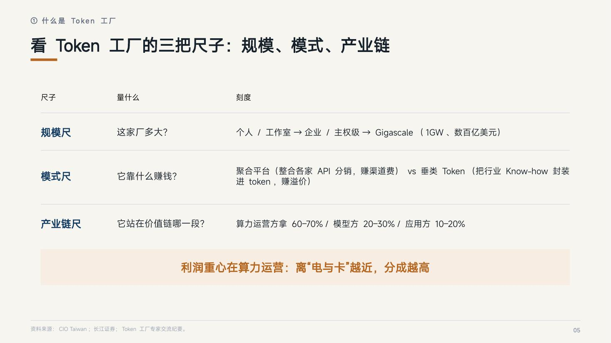

看 Token 工厂，我习惯用三把尺子去量。**规模尺**问"这家厂多大"：个人工作室 → 企业/主权级 → Gigascale（1GW、数百亿美元）；**模式尺**问"它靠什么赚钱"：聚合平台赚渠道费，垂类 Token 赚 Know-how 溢价；**产业链尺**问"它站在价值链哪一段"：目前算力运营方拿到 60–70% 的分成，利润重心离"电与卡"越近越高——这个格局后面会讲，它正在松动。

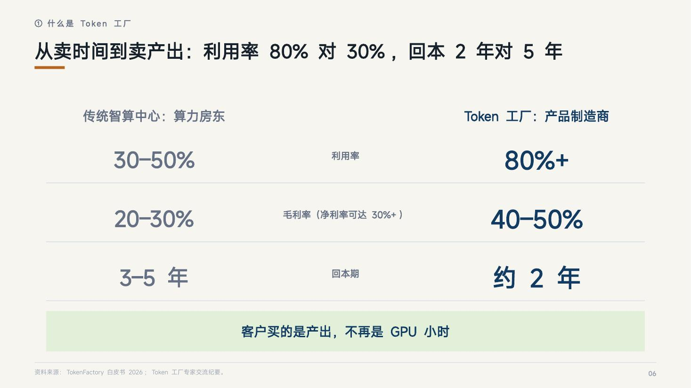

这一页是全文的第一个关键区分：**算力房东 vs 产品制造商**。传统智算中心卖 GPU 小时——利用率 30–50%、毛利率 20–30%、回本 3–5 年；Token 工厂卖产出——利用率 80%+、毛利率 40–50%、回本约 2 年。同样是那张卡，客户买的从"时间"变成"产出"，商业模式一变，账本全变。

---

## 三、先看账本与承诺，再谈理想（页 07–09）

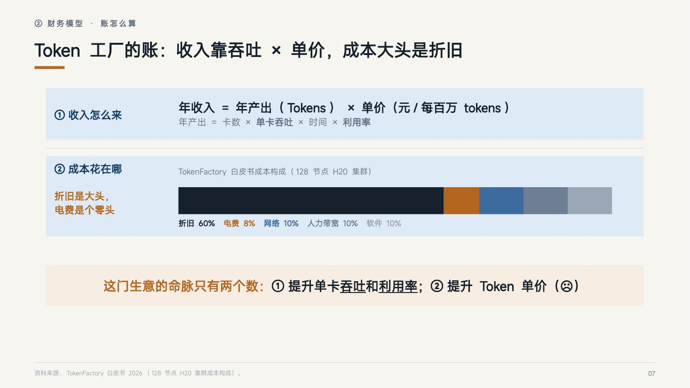

"回本 2 年、毛利率 40–50%"听起来很美，但那是别人算好的结果。把账本打开看一遍（以下数字口径以公开白皮书为准），结构是这样的：

- **收入** = 年产出 × 单价；年产出 = 卡数 × 单卡吞吐 × 时间 × 利用率。四个乘数里，卡数和时间是钱能解决的，吞吐和单价才是本事。
- **成本**（以 TokenFactory 白皮书 128 节点 H20 集群为例）：折旧 60%、电费 8%、网络 10%、人力带宽 10%、软件 10%。一个反直觉的事实：**折旧是大头，电费是个零头**——AI 工厂不吃电，吃折旧。

所以这门生意的命脉只有两个数：**① 提升单卡吞吐和利用率；② 提升 Token 单价**（页面上画了个哭脸，因为单价在价格战里是最难提的那个）。这也是全文的主线——接下来的篇幅讲第一个数怎么被技术革命掉，最后回答第二个数怎么提。

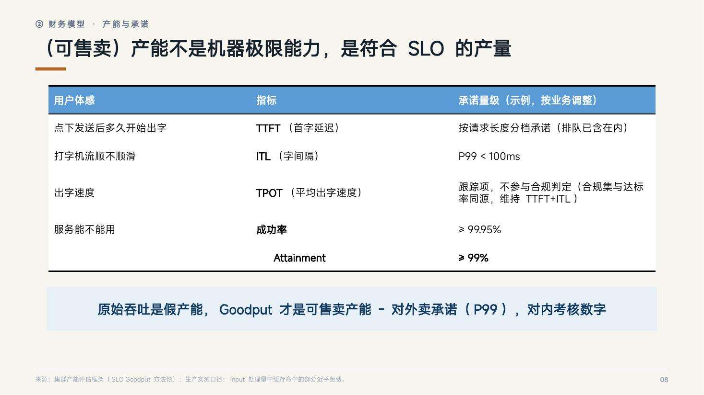

第二个数之前，先回答一个更"运营"的问题：**一台机器到底能卖多少 token？** 我自己在这件事上踩过坑，结论是：原始吞吐是"假产能"——不顾体验硬灌负载，刷出的是流失中的用户。真正可售卖的是 **Goodput**：成功且体验达标的请求产出的 token。所以产能必须配一张承诺表：TTFT 按请求长度分档、ITL P99 小于 100ms、TPOT 作为跟踪项、成功率 ≥ 99.95%、达标率 ≥ 99%（示例量级，按业务调整）。**对外卖承诺（P99），对内考核数字**——承诺与产能是一枚硬币的两面：只报产能、不担承诺，是自欺欺人；只许承诺、不练产能，是赔本买卖。

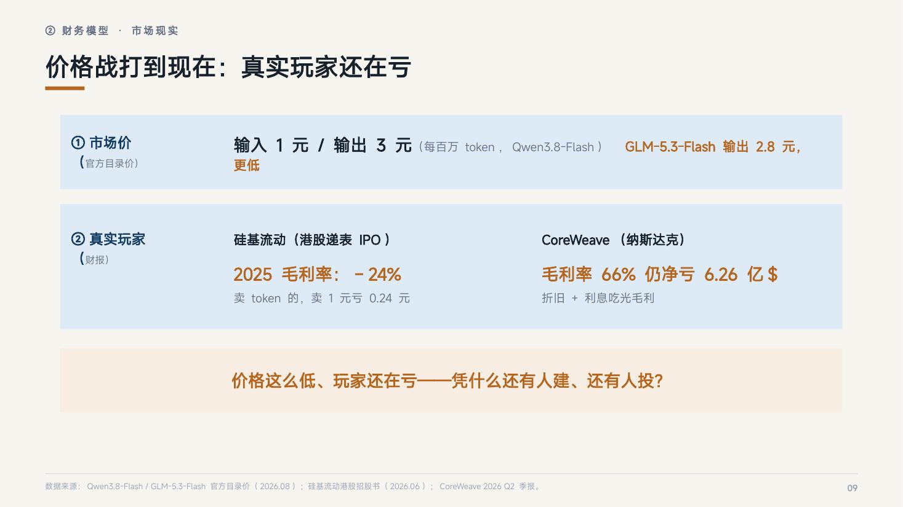

账本和承诺都看明白了，再看看市场现状，冷静一下。官方目录价里，Qwen3.8-Flash 输入 1 元 / 输出 3 元每百万 token，GLM-5.3-Flash 输出 2.8 元更低；真实玩家财报里，卖 token 的硅基流动 2025 年毛利率 −24%（卖 1 元亏 0.24 元），卖算力租赁的 CoreWeave 毛利率 66% 仍净亏 6.26 亿美元——折旧加利息吃光毛利。价格这么低、玩家还在亏，**凭什么还有人建、还有人投？** 这一页留下的悬念，是全文的转折点。

---

## 四、成本革命：把产能做上去的系统工程（页 10–18）

悬念的答案在下一页：不是市场疯了，而是有人把成本革命到了市场价以下。理解这场革命，先理解一次生成到底在干什么。

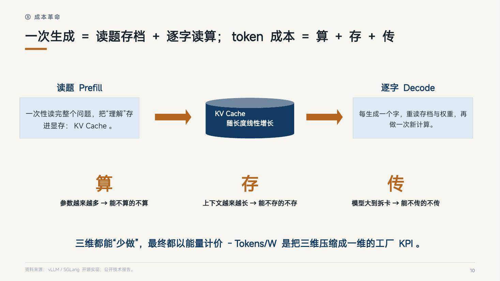

一次生成分两步：**读题（prefill）**——把整个问题读完、算完，把"理解"存进显存，这份存档叫 KV Cache，随对话长度线性增长；**逐字（decode）**——每生成一个字，都要把存档和权重重新读一遍再做一次新计算。由此推出 token 成本的三个维度：参数越来越多要省**算**、上下文越来越长要省**存**、模型大到必须拆卡要省**传**——三维都能"少做"，最终都以能量计价。

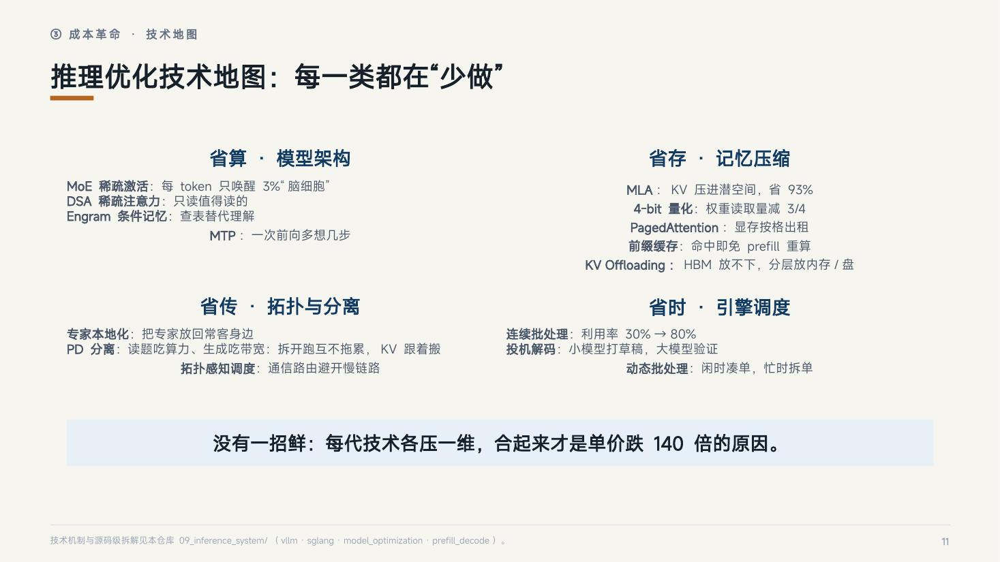

如果把业界这几年的推理优化摆成一张地图，会发现**每一类技术都在做同一件事："少做"**。省算靠模型架构（MoE 稀疏激活、DSA 稀疏注意力、Engram 条件记忆、MTP 多 token 预测）；省存靠记忆压缩（MLA、4-bit 量化、PagedAttention、前缀缓存、KV Offloading）；省传靠拓扑与分离（专家本地化、PD 分离、拓扑感知调度）；省时靠引擎调度（连续批处理、投机解码、动态批处理）。没有一招鲜——每代技术各压一维，合起来才是单价跌 140 倍的原因。

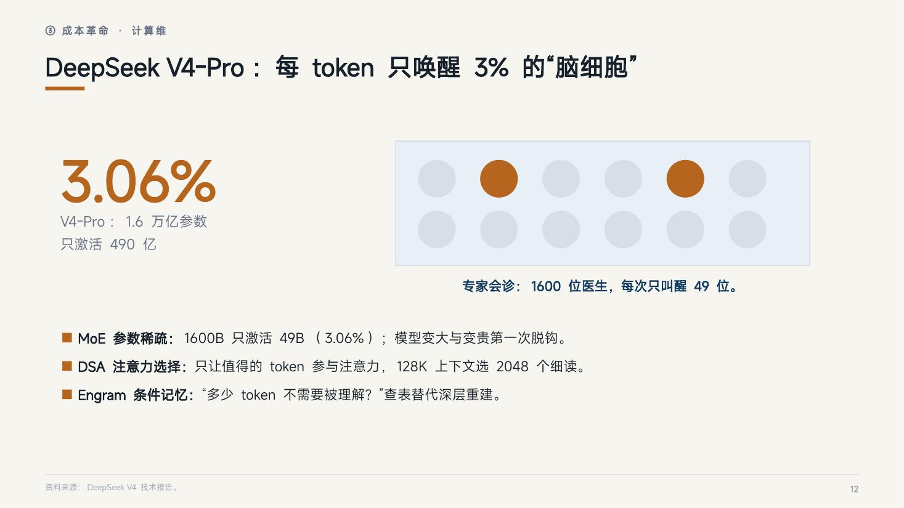

先看算力维。大模型动辄上万亿参数，如果每个 token 都过一遍全部参数，成本线性爆炸。MoE 的回答是：**让模型自己少干活**。DeepSeek V4-Pro 有 1.6 万亿参数，每生成一个 token 只激活 490 亿，唤醒率 3.06%——打个比方：1600 位医生会诊，每次只叫醒 49 位。配合 DSA（128K 上下文只选 2048 个细读）和 Engram（查表替代深层理解），模型"变大"和"变贵"第一次脱钩了。

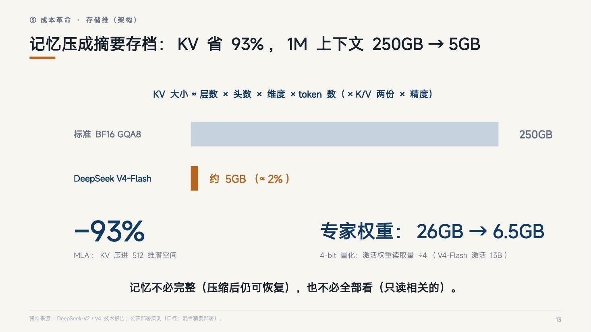

再看存储维的架构层。KV Cache 随上下文线性膨胀，1M 上下文用标准 BF16 要 250GB 显存——一张 H200 都装不下。DeepSeek 的 MLA 把 KV 压进 512 维潜空间，同样的 1M 上下文只要约 5GB，省 93%（"记忆压成摘要存档，用的时候再展开"）；激活的专家权重再压成 4-bit，读取量从 26GB 降到 6.5GB。decode 是读权重的带宽游戏，读得越少跑得越快。

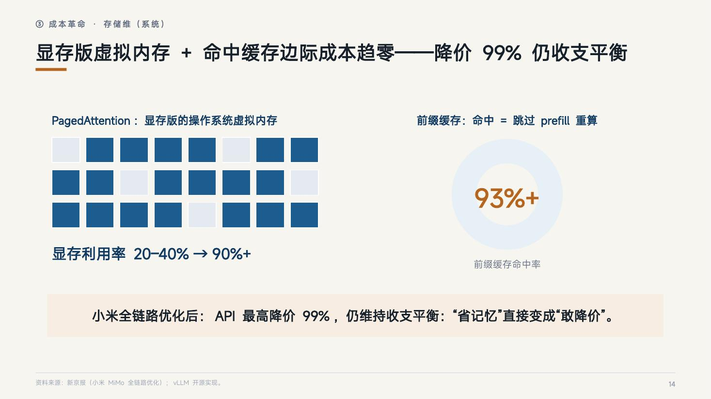

存储维的系统层同样重要。PagedAttention 是显存版的操作系统虚拟内存——KV 切块、按需放格，显存利用率从 20–40% 提到 90%+；前缀缓存命中率 93%+，命中即免掉 prefill 重算、边际成本趋零。小米全链路优化后 API 最高降价 99% 仍维持收支平衡——"省记忆"直接变成"敢降价"。

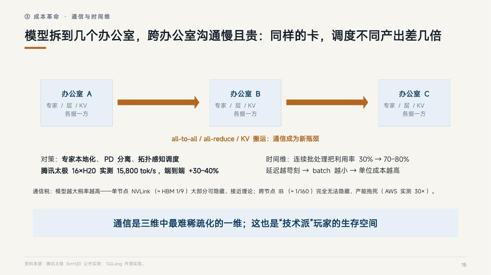

当模型大到必须拆卡，通信成为新瓶颈。画面感最强的一个比喻：把团队拆到几个办公室，专家/层/KV 各据一方，跨办公室的每次沟通都慢且贵。MoE 的 all-to-all、TP 的 all-reduce、KV 搬运都在烧通信。这里有"通信税"：单节点 NVLink 带宽约等于 HBM 的 1/9，大部分可隐藏；跨节点 IB 只有约 1/160，完全无法隐藏、产能被拖死。对策是专家本地化、**PD 分离**（读题吃算力、生成吃带宽，拆开跑互不拖累）与拓扑感知调度——腾讯太极 16×H20 实测 15,800 tok/s，端到端提升 30–40%。时间维上，连续批处理把利用率从 30% 提到 70–80%——同样的卡，调度不同，产出差几倍。

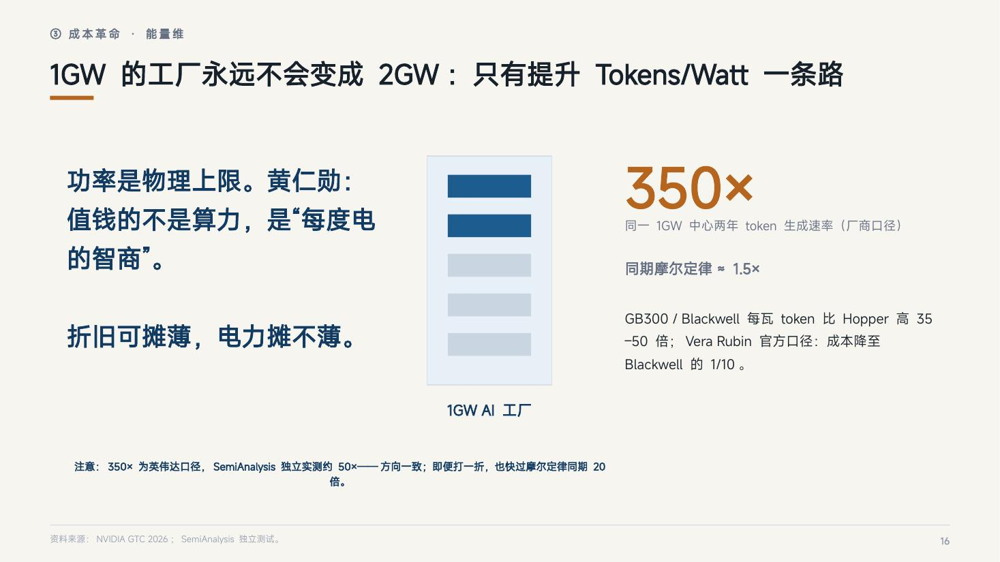

算、存、传都能"少做"，但有一个物理地板绕不开：供电。1GW 的工厂永远不会变成 2GW，功率是物理上限——黄仁勋说，值钱的不是算力，是"每度电的智商"。硬件代际就是物理地板的抬升：同一个 1GW 数据中心，两年 token 生成速率提升 350 倍（厂商口径；SemiAnalysis 独立实测约 50 倍，方向一致，即便打一折也快过摩尔定律同期 20 倍）；GB300 的每瓦 token 比 Hopper 系高 35–50 倍，下一代 Vera Rubin 官方口径是成本降至 Blackwell 的 1/10。折旧可摊薄，电力摊不薄——这就是为什么"每瓦产出"会成为工厂的头号 KPI。

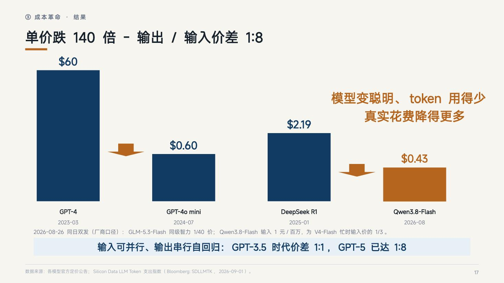

技术革命的账本结果，是一条价格瀑布：GPT-4（$60，2023-03）→ GPT-4o mini（$0.6）→ DeepSeek R1（$2.19）→ Qwen3.8-Flash（$0.43，2026-08），三年 140 倍。注意价格结构也在变：输出是串行自回归、输入可并行，输出/输入价差从 GPT-3.5 时代的 1:1 拉大到 GPT-5 时代的 1:8。模型还在变聪明、token 用得越来越少——真实任务的花费，降得比单价还要狠。就在 2026 年 8 月 26 日，智谱与阿里同日双发 Flash 模型，GLM-5.3-Flash 同级智力 1/40 的价格（厂商口径）——价格瀑布延伸到了"昨天"。

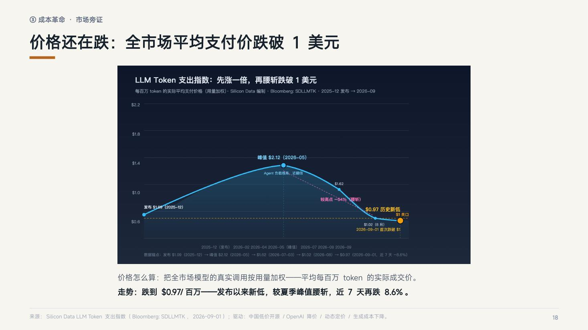

不只是个别模型降价，市场整体也在降。Silicon Data LLM Token 支出指数（把全市场真实调用按用量加权）显示：平均每百万 token 的实际成交价已跌到 0.97 美元——发布以来新低，较夏季峰值腰斩。所有人的平均支付价都跌破 1 美元了，价格战仍在继续。

---

## 五、更大的盘子，与更值钱的 token（页 19–23）

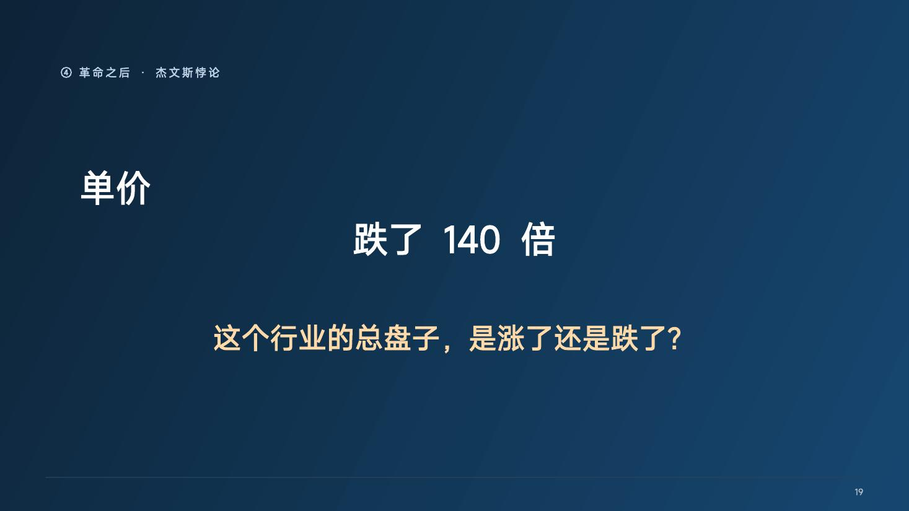

价格跌了 140 倍，用量涨了 1400 倍——那么问题来了：**这个行业的总盘子，是涨了还是跌了？** 这一页我在现场没有给答案，停了几秒让观众先猜。经济学 150 年前就预言过这件事：杰文斯悖论——煤便宜了，用量多了，总开支反而涨。

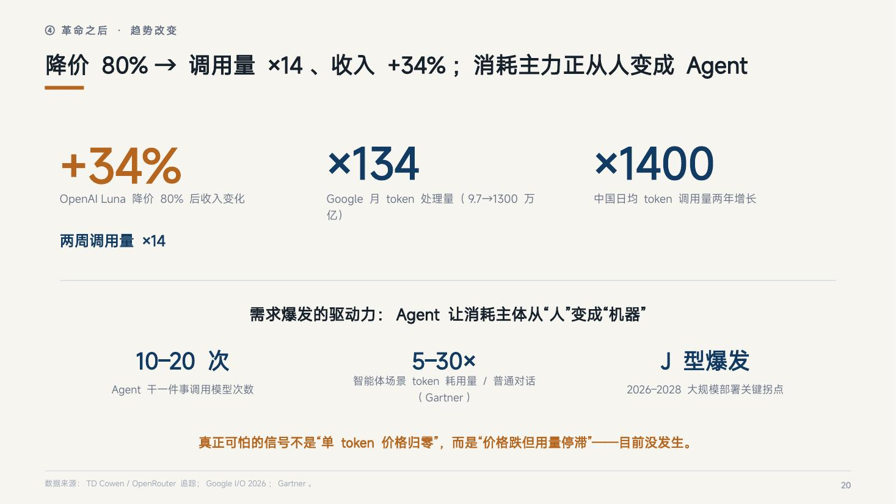

数据揭晓：OpenAI Luna 降价 80%，两周调用量 ×14、收入 +34%；Google 月 token 处理量从 9.7 万亿涨到 1300 万亿（约 134 倍）；中国日均两年 ×1400。更深远的变化在需求结构里：**消耗主力正从"人"变成"机器"**——Agent 干一件事要调用模型 10–20 次，token 耗用是普通对话的 5–30 倍，2026–2028 是大规模部署的关键拐点。真正可怕的信号从来不是"单 token 价格归零"，而是"价格跌但用量停滞"——目前没有发生。

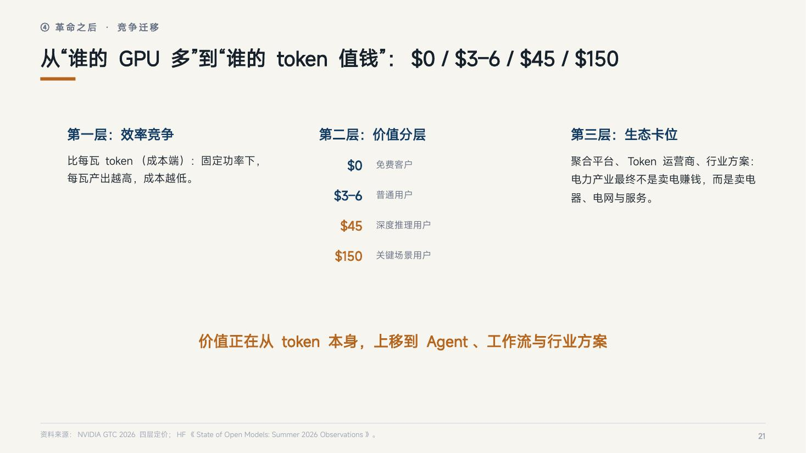

盘子变大的同时，竞争维度在迁移：从"谁的 GPU 多"到"谁的 token 值钱"。竞争分三层——第一层效率竞争，比每瓦 token；第二层价值分层，token 已经按 $0 / $3–6 / $45 / $150 分成四档；第三层生态卡位，聚合平台、Token 运营商、行业方案。价值正在从 token 本身，上移到 Agent、工作流与行业方案。

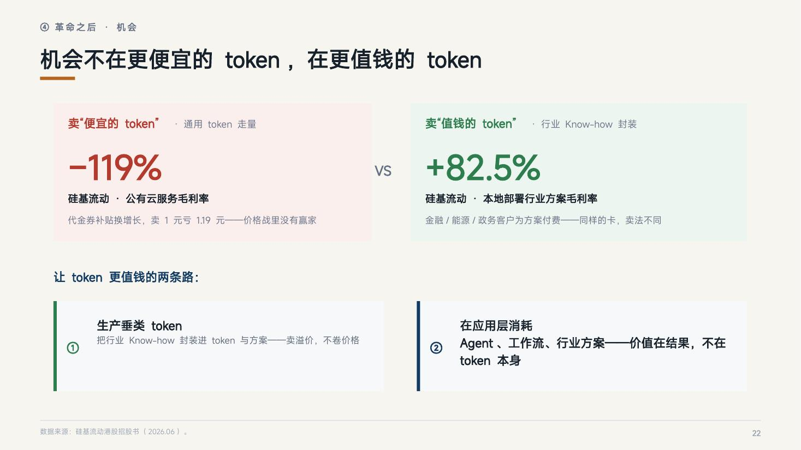

这页是整场分享的落点，也是回答"怎么才能赚钱"的答案：**机会不在更便宜的 token，在更值钱的 token**。最有说服力的证据来自同一家公司的两个数字——硅基流动的公有云服务（卖通用 token 走量）毛利率 **−119%**，代金券补贴换增长，卖 1 元亏 1.19 元；而它的本地部署行业方案毛利率 **+82.5%**，金融、能源、政务客户为方案付费。同样的卡，卖法不同，天壤之别。让 token 更值钱有两条路：**一是生产垂类 token**，把行业 know-how 封装进 token 与方案，卖溢价、不卷价格；**二是在应用层消耗**，做 Agent、工作流、行业方案——价值在结果，不在 token 本身。

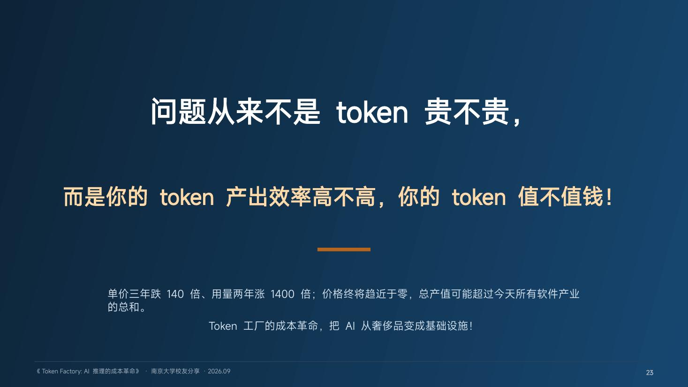

珍珠街电站送出的第一度电点亮了几条街，140 多年后，电成了文明的基础设施，实际电价降了几十倍，电力产业的总产值远超所有人的想象。Token 正在走同样的路——价格终将趋近于零，总产值可能超过今天所有软件产业的总和。所以问题从来不是"token 贵不贵"，而是**你的 token 产出效率高不高，你的 token 值不值钱**。

---

## 现场互动：国产算力与英伟达的真实差距

分享之后最热烈的讨论，集中在**国产算力卡与英伟达的真实差距**上。到场的多位从业者参与了坦诚的交流，我的观察分三层：

1. **差距首先来自硬件设计本身**。单卡算力、显存带宽、互联能力上，国产卡与国际最先进产品仍有代际差，这不是靠软件能完全抹平的。
2. **差距同样来自算子库与软件生态的成熟度**。CUDA 生态二十年积累的算子库、调试工具与社区沉淀，让"同样的模型跑出同样好的性能"需要付出大量适配成本——硬件是"能跑"，软件生态决定"跑得好、跑得省"。
3. **软硬件的深度协同优化，仍是国产算力绕不开的长期课题**。好消息是，推理侧的工作负载比训练侧更规律，这给国产算力在推理场景提供了追赶窗口——正如这次分享反复强调的：推理优化的本质是系统工程，在既定硬件上把每一瓦的 token 产出榨出来，这条路对国产芯片同样适用。

---

*数据说明：本文市场数据为 2026 年 8–9 月口径；厂商宣传口径（如 350×、1/40 价）已在文中标注；产能承诺表为示例量级、按业务调整。延伸阅读：对外文档《Token 工厂的产能怎么算？》[cluster-capacity-measurement.md](cluster-capacity-measurement.md)（Goodput 框架与 AIPerf 落地）。*
